# OTOT Task D

Name: Erin May Gunawan

Matric No.: A0200765L

GitHub Repo: [Task D](https://github.com/erinmayg/OTOT-D)

## Setting up Multi-Node Apache Kafka

1. Copy the contents of the [`docker-compose.yml`](./docker-compose.yml) file and place it in your chosen directory.

2. Run the following command on your terminal to start up the containers, make sure you are in the same directory as your `docker-compose.yml` file.

   ```bash
   docker-compose up
   ```

   > Note: You may use the `docker-compose up -d` if you want the process to run on background

   Take note of the network used in by the containers, by default it is set to the name of your current directory.

   > So for example if your `docker-compose.yml` file path is `./otot-d/docker-compose.yml` your network will be `otot-d_default`

   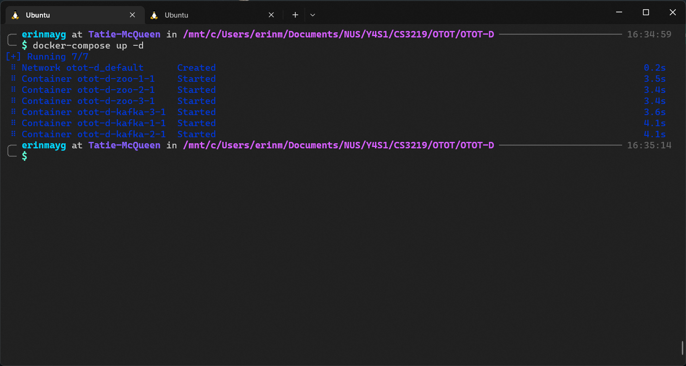

3. Change the `/etc/hosts` file in your machine to include the hostnames of the kafka containers.

   ```bash
   sudo vim /etc/hosts
   ```

   Add the following content:

   ```text
   0.0.0.0         kafka-1 kafka-2 kafka-3
   ```

   > `kafka-*` is the hostname set on your `docker-compose.yml` file (i.e. `kafka-*.hostname`)

   It should output the similar to the following

   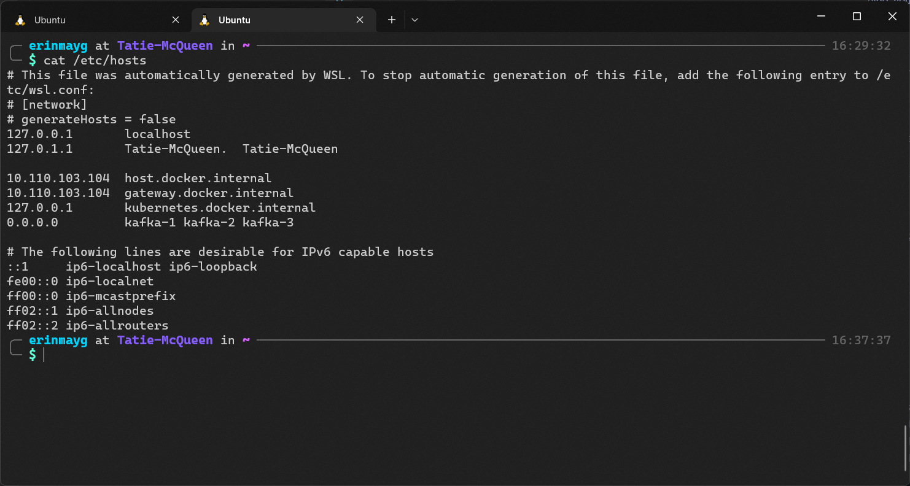

4. Once the containers are running, you may test whether or not it is working by using [Kafkacat](#kafkacat) or [Docker Commands](#docker-commands).

## Kafkacat

### Installation

Install kafkacat if you don't have it already. For Ubuntu users, you may do so by running the commands:

```bash
sudo apt-get update
sudo apt-get install kafkacat
```

For more details on installation refer to this [link](https://github.com/edenhill/kcat).

### Kafkacat Testing

1. To list out all brokers run

   ```bash
   kafkacat -L -b kafka-1:19092
   ```

   > You may replace `kafka-1:19092` with any other kafka nodes, provided you give the correct port no. (refer to `kafka-*.ports` from your `docker-compose.yml`)

   It should give the following output

   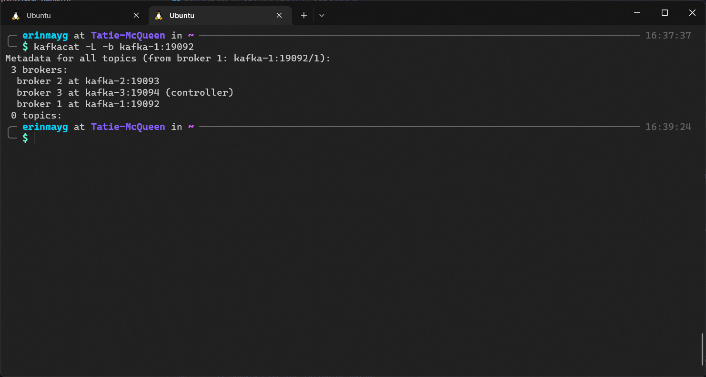

   Take note of the `controller` node (in this case, it's `broker 3`).

2. Try sending messages and receiving messages.

   In one terminal run

   ```bash
   kafkacat -P -b kafka-1:19092 -t cs3219-d
   ```

   This terminal will serve as the publisher (denoted by the `-P` flag) with topic `cs3219-d` (denoted by the `-t` flag).

   > Process doesn't end immediately as it's waiting for input messages from user via `stdin`.

   In another terminal run

   ```bash
   kafkacat -C -b kafka-1:19092 -t cs3219-d
   ```

   This terminal will serve as the consumer (denoted by `-C` flag) listening to the topic `cs3219-d`.

   In the Publisher terminal, you can start typing in messages, and the Consumer terminal should reflect the changes.

   To stop listening for messages for the Publisher terminal, press `Ctrl + D`, and for the Consumer press `Ctrl + C`.

   The output should be the folllowing

   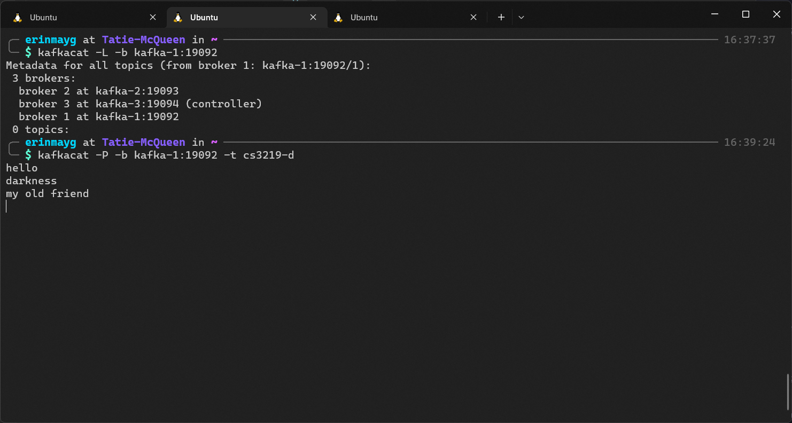

   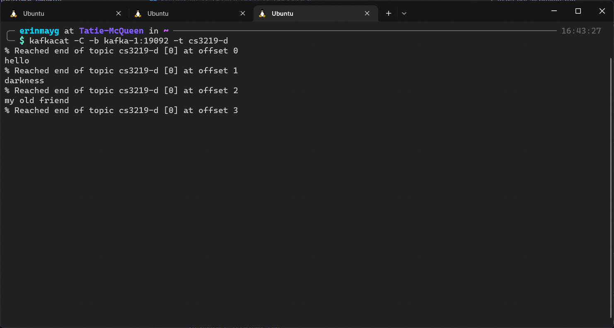

   And when you relist all the brokers via the command

   ```bash
   kafkacat -L -b kafka-1:19092
   ```

   It should display the new topic `cs3219-d`

   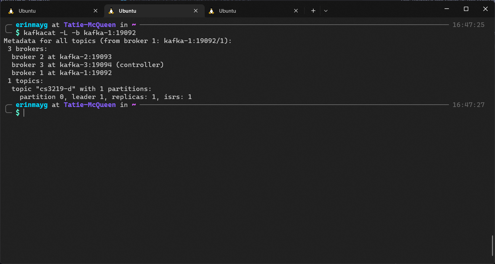

3. Test Controller node failure.

   To test this failure, remove the container of the controller node (in this case `kafka-3`).

   You can check the container name via the command

   ```bash
   docker ps -a
   ```

   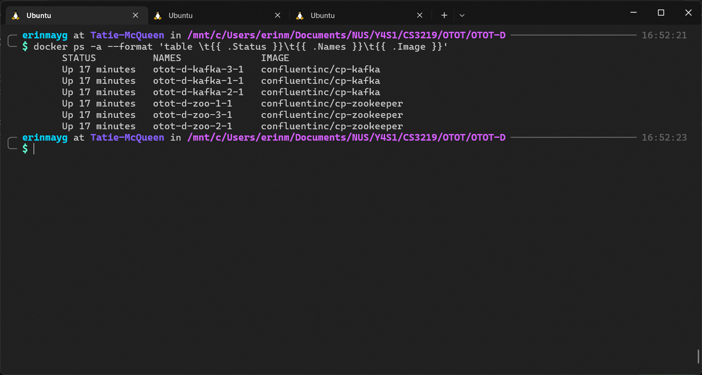

   ```bash
   docker stop otot-d-kafka-3-1
   ```

   This will stop the container (not delete).

4. After a couple of moments, run the broker list command again

   ```bash
   kafkacat -L -b kafka-1:19092
   ```

   The `controller` should be changed to a new broker.

   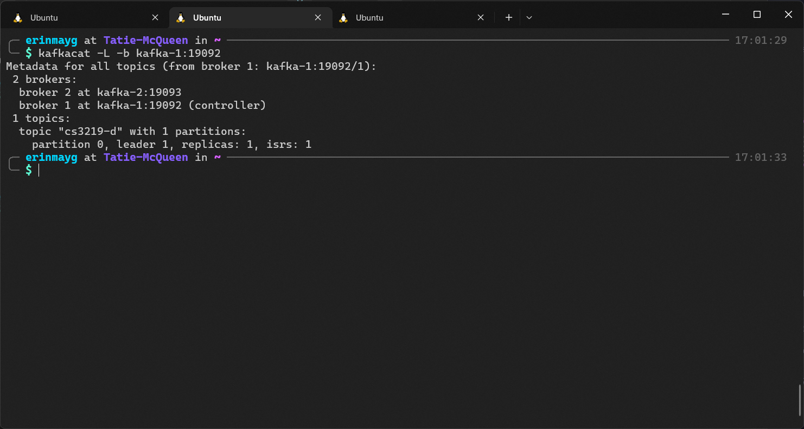

   In this case, it was changed to `broker 1`.

## Docker Commands

### Docker Testing

1. To run kafka commands, you need to enter the broker terminal

   List out all container names by running

   ```bash
   docker ps -a
   ```

   It should give an output similar to the following

   

   Enter the terminal of any kafka containers

   ```bash
   docker exec -it otot-d-kafka-1-1 bash
   ```

   In another terminal, do the same with a different broker

   example:

   ```bash
   docker exec -it otot-d-kafka-2-1 bash
   ```

   One container will serve as the publisher, the other as a consumer.

2. Start testing sending and receiving messages

   One container will serve as the publisher, to create a topic run

   ```bash
   kafka-topics --create --topic cs3219-task-d --partitions 1 --replication-factor 3 --if-not-exists --bootstrap-server localhost:19092
   ```

   > Note that `19092` is the port number of the kafka container (refer to `kafka-*.ports`), in this case `kafka-1` is used.

   Check if the topic `cs3219-task-d` has been created by running:

   ```bash
   kafka-topics --list --bootstrap-server localhost:19092
   ```

   It should output the following

   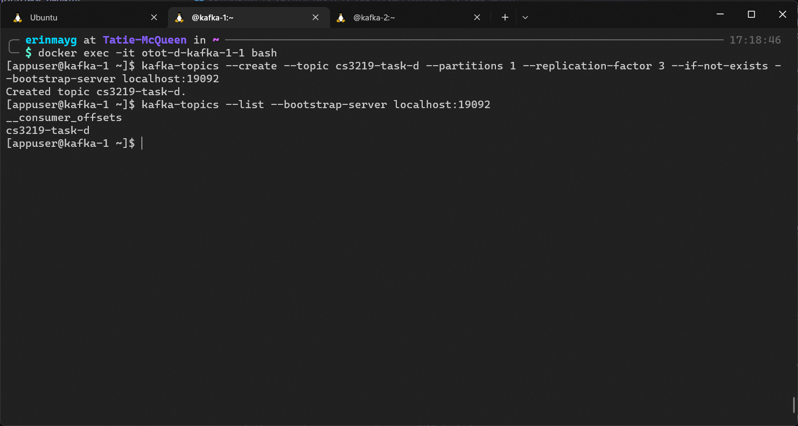

   and to type in messages, run:

   ```bash
   kafka-console-producer --topic cs3219-task-d --bootstrap-server localhost:19092
   ```

   The command when end immediately as it's waiting for input messages from `stdin`.

   Try typing in a couple of messages, once finished press `Ctrl + D`.

   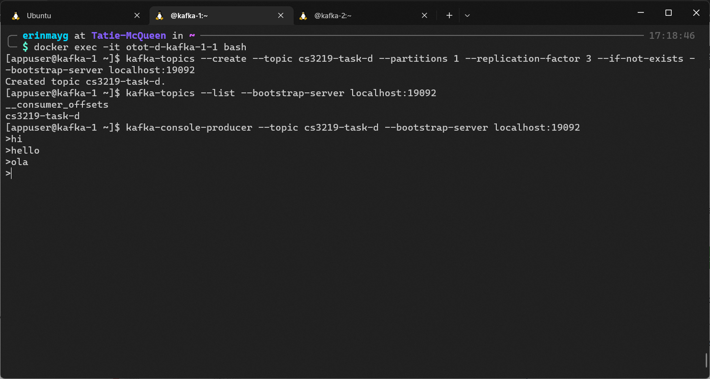

   the other as a consumer, run

   ```bash
   kafka-console-consumer --topic cs3219-task-d --broker-list localhost:19093
   ```

   > Note that `19093` is the port number of the kafka container (refer to `kafka-*.ports`), in this case `kafka-2` is used.

   It should display the messages.

   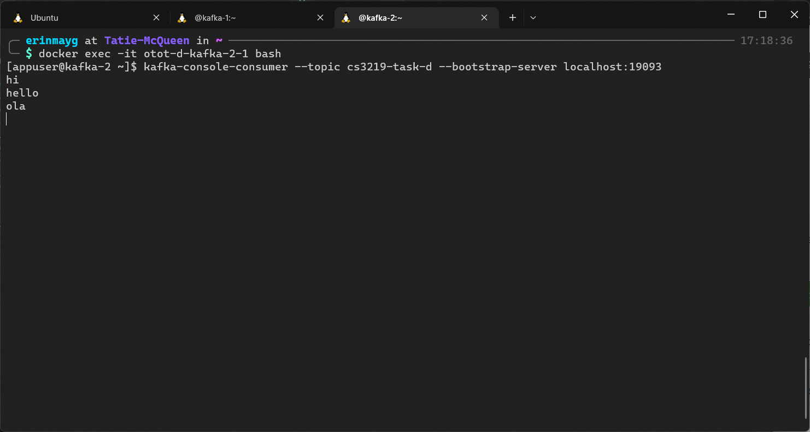

   To stop listening press `Ctrl + C`.

3. Test Controller Node failure

   On one of the kafka containers, run

   ```bash
   zookeeper-shell zoo-1:12181
   ```

   > You may change `zoo-1:12181` to any zookeeper containers and their respective port with the format `<hostname>:<port>` (refer to `zoo-*.hostname` and `zoo-*.environments.ZOOKEEPER_CLIENT_PORT` from the `docker-compose.yml` file respectively).

   You should enter the zookeeper shell, you can now type

   ```bash
   get /controller
   ```

   and it should return the broker id of the controller

   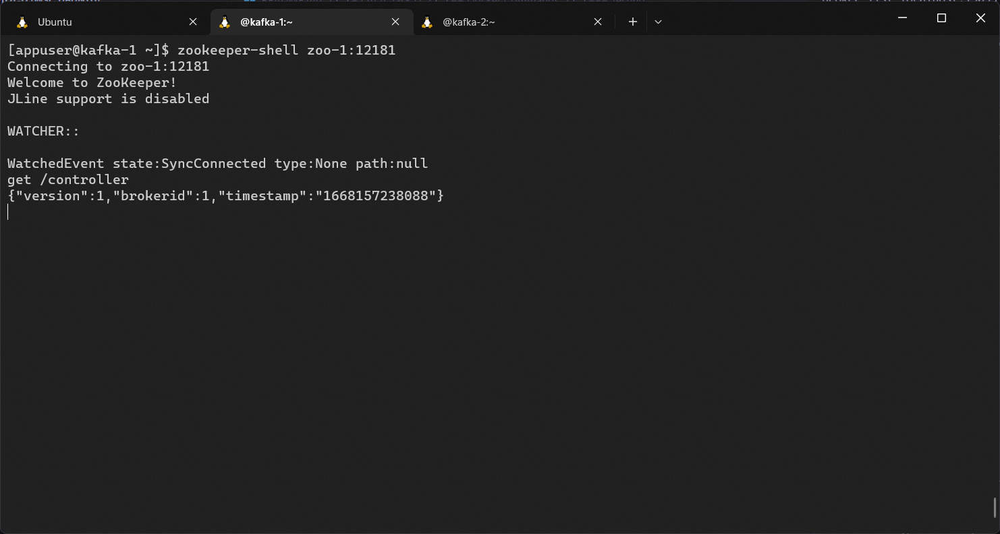

   In this case, the controller is `broker 1`.

   `Ctrl + C` to exit zookeeper-shell and `exit` to exit the kafka container.

   To stop the controller node, take note of the name of the kafka container from step 1. and run

   ```bash
   docker stop otot-d-kafka-1-1
   ```

   On a different kafka container, run the commands in step 3 again and it should output a different `broker id` as the controller.

   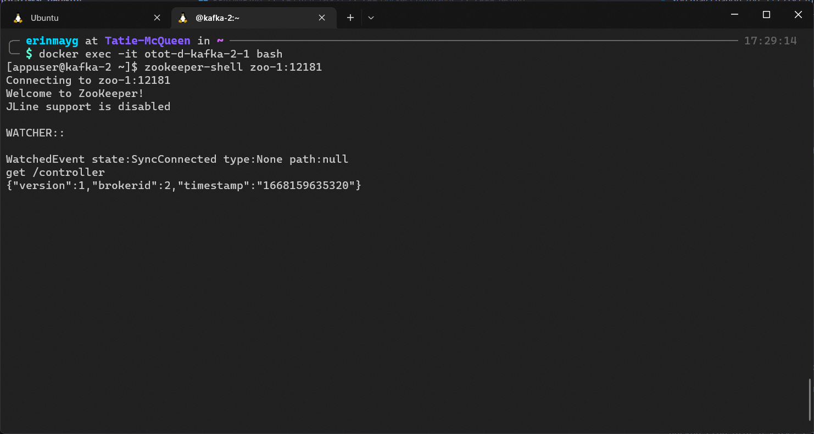

   Now, `broker 2` is the new controller.

   Exit the shell with `Ctrl + C` and exit the kafka container using `exit`.

## Clean up

To stop the containers, navigate to the directory of `docker-compose.yml` and run

```bash
docker-compose down
```

It should stop and remove all the containers.
